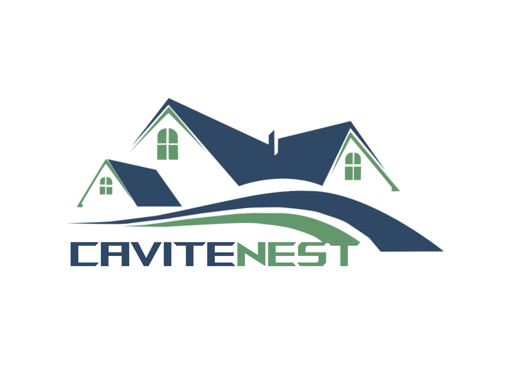

<!-- PROJECT SHIELDS -->
[![Contributors][contributors-shield]][contributors-url]
[![MIT License][license-shield]][license-url]

<!-- PROJECT LOGO -->
 

  

<h3 align="center">CaviteNest</h3>

  

    A Rental and Booking Platform in Cavite City.
     
    (Undergraduate Capstone Project)
  

<!-- TABLE OF CONTENTS -->

  
Table of Contents

  <ol>
    <li>
      <a href="#about-the-project">About The Project</a>
      <ul>
        <li><a href="#tech-stack">Tech Stack</a></li>
      </ul>
    </li>
    <li><a href="#roadmap">Roadmap</a></li>
      <ul>
        <li><a href="#major">Major</a></li>
        <li><a href="#minor">Minor</a></li>
      </ul>
    <li><a href="#contributing">Contributing</a></li>
    <li><a href="#development-team">Development Team</a></li>
    <li><a href="#license">License</a></li>
    <li><a href="#contact">Contact</a></li>
    <li><a href="#acknowledgments">Acknowledgments</a></li>
  </ol>

<!-- ABOUT THE PROJECT -->

## About The Project

[![CaviteNest][product-gif]](https://cavite-nest.vercel.app)

**CaviteNest** is an online rental and booking platform focused on properties in Cavite City.

The platform allows users to list their properties for booking or renting, and easily inquire their accommodations. It aims to provide a seamless experience for both property owners and renters, with a user-friendly interface and reliable backend.

**Features:**

- User account management (registration, login, and profile)
- Search filters for finding the right property
- Interactive property details page with photos, descriptions, and booking or rental prices
- Property listing, booking, and rental system
- Real-time messaging to communicate with lessors or other lessees.
- Favorite interesting places for future plans or collections.
- More to add...

*This system was developed as part of our coursework at Cavite State University - Cavite City Campus.*

(<a href="#readme-top">back to top</a>)

<!-- TECH STACK -->

### Tech Stack
- **Made with** [![JavaScript][JavaScript.js]][JavaScript-url] but consists **99%** of [![TypeScript][TypeScript]][TypeScript-url]-based.
- **Front-end** is mostly [![React][React.js]][React-url] with a touch of [![Next][Next.js]][Next-url] that also contributes to the **back-end**.
- [![Node][Node.js]][Node.js-url] was the main handler of the **server-side functions**.
- The **pre-built CSS classes** of [![TailwindCSS][TailwindCSS]][Tailwind-url] were mostly used to design the web layout.
- While [![MongoDB][MongoDB]][MongoDB-url] is the **database** of choice.
- **Queries handler** via [![Prisma][Prisma]][Prisma-url]. An ORM that simplifies database access for JS & TS objects.
- **Media** storage and manipulation is made possible by [![Cloudinary][Cloudinary]][Cloudinary-url]
- **Subscription plan payments** is handled by [![Stripe][Stripe]][Stripe-url]
- Utilizing [![Pusher][Pusher]][Pusher-url] for its **real-time features**.
- **Deployed and Hosted** by [![Vercel][Vercel]][Vercel-url]

(<a href="#readme-top">back to top</a>)

<!-- ROADMAP -->

## Roadmap
- [x] Stripe Payments - Integrating Stripe for plan subscription payments
- [x] Multiple Images Upload in Listing Property - Allow property owners to upload multiple images per listing
- Email Notifications
  - [x] Reservations
  - [ ] Cancellations
  - [x] Messages
- Messaging
  - [ ] Image uploading
- Locations
  - [ ] Limit the location to only be around Cavite City
- Error Trapping
  - [x] First Batch
  - [x] Pre-defense Batch
  - [ ] File formats & sizes (specified & trapped)
- Design Improvements
  - [x] First Batch
  - [x] Pre-defense Batch
- [x] Pre-final defense Release (0.8)

(<a href="#readme-top">back to top</a>)

<!-- CONTRIBUTING -->
## Contributing

Contributions are what make the open source community such an amazing place to learn, inspire, and create. Any contributions you make are **greatly appreciated**.

If you have a suggestion that would make this better, please fork the repo and create a pull request. You can also simply open an issue with the tag "enhancement".
Don't forget to give the project a star! Thanks again!

1. Fork the Project
2. Create your Feature Branch (`git checkout -b feature/AdditionalFeature`)
3. Commit your Changes (`git commit -m 'Add some AdditionalFeature'`)
4. Push to the Branch (`git push origin feature/AdditionalFeature`)
5. Open a Pull Request

(<a href="#readme-top">back to top</a>)

<!-- TEAM -->
## Development Team
[![CaviteNest][productteam-png]](https://cavite-nest.vercel.app)

<!-- LICENSE -->
## License

Distributed under the MIT License. See `LICENSE.txt` for more information.

(<a href="#readme-top">back to top</a>)

<!-- CONTACT -->

## Contact

CaviteNest - cavitenest.platform2024@gmail.com

Project Link: [https://github.com/cld-kent0/CaviteNest](https://github.com/cld-kent0/CaviteNest)

(<a href="#readme-top">back to top</a>)

<!-- ACKNOWLEDGMENTS -->

## Acknowledgments

- Special thanks to the open-source community for their libraries and frameworks that made this project possible.
- Gratitude to those who came up with testing, suggestions, and evaluations during development.
- Huge appreciation to the team who persisted through hardships in developing the system (i.e. learning the language, making the features work, and documentation).
- Shoutouts to Vercel who made our deployment possible without any fee and restrictive limitations.

(<a href="#readme-top">back to top</a>)

<!-- MARKDOWN LINKS & IMAGES -->

[product-gif]: https://github.com/cld-kent0/CaviteNest/blob/master/public/images/gif.gif
[productteam-png]: https://github.com/cld-kent0/CaviteNest/blob/master/public/images/team.png
[contributors-shield]: https://img.shields.io/github/contributors/cld-kent0/CaviteNest.svg?style=for-the-badge
[contributors-url]: https://github.com/cld-kent0/CaviteNest/graphs/contributors
[license-shield]: https://img.shields.io/github/license/cld-kent0/CaviteNest?style=for-the-badge
[license-url]: https://github.com/cld-kent0/CaviteNest/blob/master/LICENSE.txt
[JavaScript.js]: https://img.shields.io/badge/JavaScript-%231a4065?style=for-the-badge&logo=Javascript
[JavaScript-url]: https://www.w3schools.com/js
[Next.js]: https://img.shields.io/badge/next.js-000000?style=for-the-badge&logo=nextdotjs&logoColor=white
[Next-url]: https://nextjs.org
[React.js]: https://img.shields.io/badge/react.js-black?style=for-the-badge&logo=react
[React-url]: https://reactjs.org/
[TailwindCSS]: https://img.shields.io/badge/tailwindcss-%23445469?style=for-the-badge&logo=tailwindcss
[Tailwind-url]: https://tailwindcss.com/
[MongoDB]: https://img.shields.io/badge/MongoDb-%23001f2c?style=for-the-badge&logo=mongodb&logoColor=%2300fe69
[MongoDB-url]: https://www.mongodb.com
[Prisma]: https://img.shields.io/badge/Prisma-%23457dd1?style=for-the-badge&logo=prisma
[Prisma-url]: https://www.prisma.io
[TypeScript]: https://img.shields.io/badge/Typescript-lightblue?style=for-the-badge&logo=typescript
[TypeScript-url]: https://www.typescriptlang.org/
[Node.js]: https://img.shields.io/badge/Node.js-%23e1efd8?style=for-the-badge&logo=node.js
[Node.js-url]: https://nodejs.org/en
[Cloudinary]: https://img.shields.io/badge/Cloudinary-%23ced6f4?style=for-the-badge&logo=cloudinary&logoColor=blue
[Cloudinary-url]: https://cloudinary.com/
[Stripe]: https://img.shields.io/badge/stripe-%23635bff?style=for-the-badge&logo=stripe&logoColor=white
[Stripe-url]: https://stripe.com/
[Pusher]: https://img.shields.io/badge/Pusher-%232f0b4e?style=for-the-badge&logo=pusher&logoColor=%2305c46d
[Pusher-url]: https://pusher.com/
[Vercel]: https://img.shields.io/badge/Vercel-black?style=for-the-badge&logo=vercel
[Vercel-url]: https://vercel.com
